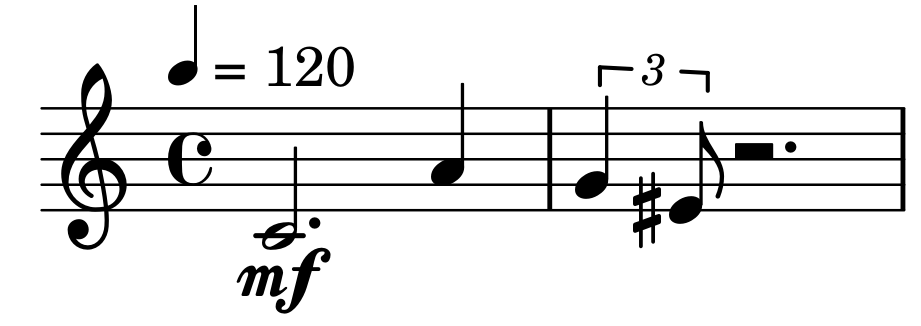

# mutwo

[](https://circleci.com/gh/mutwo-org/mutwo)
[](https://mutwo.readthedocs.io/en/latest/)
[](https://www.gnu.org/licenses/gpl-3.0)
[](https://badge.fury.io/py/mutwo)
[](https://github.com/psf/black)

### disclaimer: This framework is still in an early stage of development and the API may still change until version 1.0.0.

**Mutwo** is a flexible, event based framework for composing music or other time-based arts in Python. It aims to help composers to build musical structures in a meaningful way and translate those structures to different third party objects (e.g. midi files, [csound](https://csound.com/) scores, musical notation with [Lilypond](https://lilypond.org/) via [abjad](https://github.com/Abjad/abjad)). The general design philosophy stresses out the independence and freedom of the user with the help of generic data structures and an easily extensible and tweakable software design.

The following example generates a short midi file:

```python3
from mutwo.events import basic, music
from mutwo.converters import frontends
simple_melody = basic.SequentialEvent(
    [
        music.NoteLike(pitch_name, duration=duration, volume="mf")
        for pitch_name, duration in (
            ("c", 0.75),
            ("a", 0.25),
            ("g", 1 / 6),
            ("es", 1 / 12),
        )
    ]
)
midi_file_converter = frontends.midi.MidiFileConverter("my_simple_melody.mid")
midi_file_converter.convert(simple_melody)
```

Making Western notation via [abjad](https://github.com/Abjad/abjad) of the same melody:

```python3
import abjad
abjad_voice_converter = frontends.abjad.SequentialEventToAbjadVoiceConverter()
abjad_voice = abjad_voice_converter.convert(simple_melody)
abjad_score = abjad.Score([abjad.Staff([abjad_voice])])
abjad.show(abjad_score)
```




### Documentation

For more information how to use **mutwo** read the [documentation](https://mutwo.readthedocs.io/en/latest/).


### Installation

**Mutwo** is available on [pypi](https://pypi.org/project/mutwo/) and can be installed via pip:

```sh
pip3 install mutwo
```

For using different backends or frontends (midi, abjad, ...) **mutwo** may need additional extra requirements. They can be installed by adding the respective backend in parenthesis:

```sh
pip3 install mutwo[abjad]
```

To install all extra requirements simply run:

```sh
pip3 install mutwo[all]
```

### Requirements

Depending on the used converter classes, **mutwo** may need additional software to work properly. For using the Csound converter, you should install Csound first. For using Lilypond via **mutwos** abjad Converter, install Lilypond first. For using the ISiS converter, install ISiS first.


### Similar projects

There are a many similar composition frameworks. Maybe one of them fits better to your particular use-case:

**Python based composition frameworks:**

- [scamp](http://scamp.marcevanstein.com/): "SCAMP is a computer-assisted composition framework in Python designed to act as a hub, flexibly connecting the composer-programmer to a variety of resources for playback and notation."
- [isobar](https://github.com/ideoforms/isobar): "isobar is a Python library for creating and manipulating musical patterns, designed for use in algorithmic composition, generative music and sonification."
- [kodou](https://github.com/ertpoi/kodou): "Kodou is a small module for algorithmic music notation which runs on top of the Lilypond (versions 2.18 to 2.21.0) compiler"
- [JythonMusic](https://jythonmusic.me/): "JythonMusic is an environment for music making and creative programming."


**Composition frameworks in other languages:**

- [slippery-chicken](https://michael-edwards.org/sc/): "a Common Lisp and CLOS package for algorithmic composition."
- [OpenMusic](https://openmusic-project.github.io/): "OpenMusic (OM) is a visual programming language for computer-assisted music composition created at IRCAM, inheriting from a long tradition of computer-assisted composition research."
- [Euterpea](http://www.euterpea.com/): "Euterpea is a cross-platform, domain-specific language for computer music applications embedded in the Haskell programming language."
- [jMusic](http://explodingart.com/jmusic/): "jMusic is a project designed to provide composers and software developers with a library of compositional and audio processing tools."
- [Comic](https://github.com/simonbahr/Comic): "A Lisp-Environment for Inter-Media Composition."
