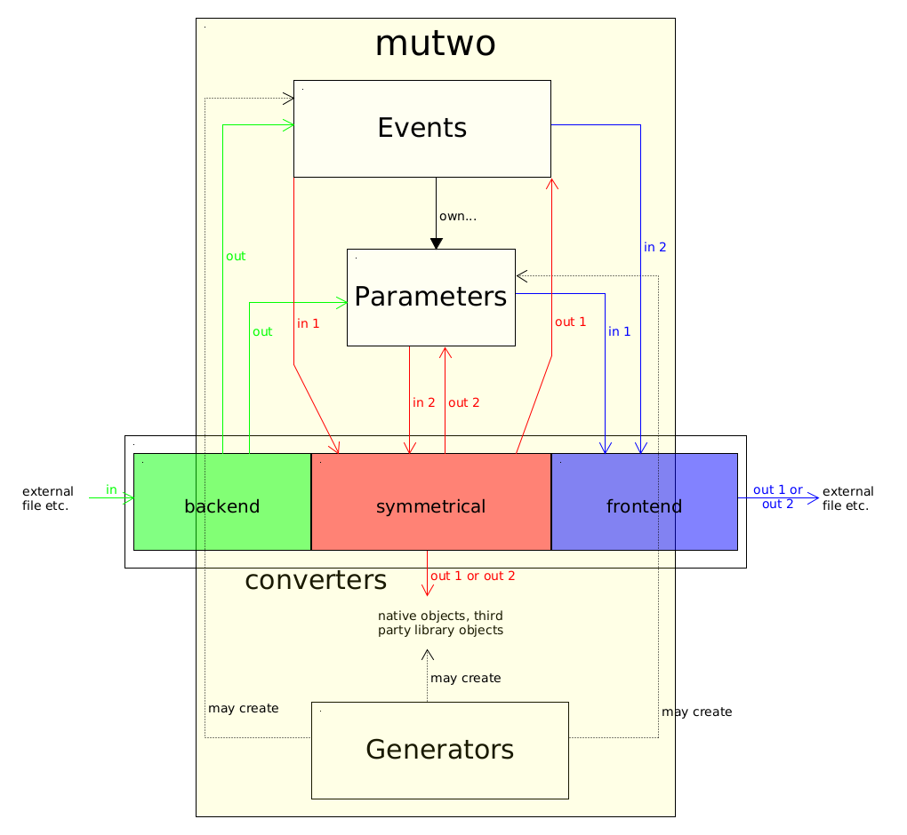

# mutwo.core

This is the `core` package of the [mutwo ecosystem](https://github.com/mutwo-org/.github/blob/main/profile/README.md).
It mainly implements general purpose event abstractions, parameter base classes and other shared utility functions.
Its independent from specific medias, aesthetics or interfaces and only provides a common base library.
Any mutwo package depends on this core package.

